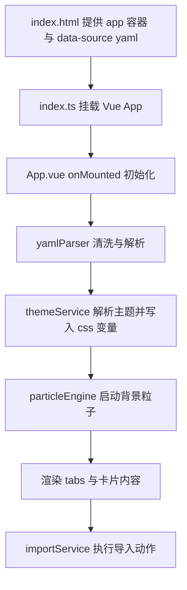

# 角色查看器 3.0 项目说明
Codex写的，沒看

## 1. 项目在做什么

本项目当前主线是一个基于 Vue 3 的角色卡前端界面：**角色查看器 3.0**

核心能力：

1. 从 YAML 文本读取角色数据并渲染 UI
2. 按种族和生命层级应用主题色
3. 展示属性、档案、技能、装备、物品、登神长阶、背景故事
4. 提供粒子背景特效
5. 提供导入能力：
   - 导入到 MVU 变量
   - 保存到聊天世界书
6. 当 YAML 解析失败时，给出可读的错误定位和排查提示

当前主要开发路径：

- `src/角色查看器/3.0/App.vue`
- `src/角色查看器/3.0/services/yamlParser.ts`
- `src/角色查看器/3.0/services/importService.ts`
---
## 2. 快速开始
### 2.1 环境要求

- Node.js 18+
- pnpm
### 2.2 安装依赖

```bash
pnpm install
```
### 2.3 开发模式
```bash
pnpm watch
```
### 2.4 生产构建
```bash
pnpm build
```
---

## 3. 目录与职责
### 3.1 角色查看器 3.0 目录

```text
src/角色查看器/3.0/
├── App.vue                   # 主界面、主状态、交互与样式
├── index.html                # 页面容器与 YAML 数据入口
├── index.ts                  # Vue 挂载入口
├── types.ts                  # 类型定义
└── services/
    ├── common.ts             # 通用工具
    ├── yamlParser.ts         # YAML 清洗与解析、友好错误
    ├── themeService.ts       # 主题解析与 CSS 变量写入
    ├── particleEngine.ts     # 粒子背景引擎
    └── importService.ts      # 导入 MVU / 世界书
```

### 3.2 关键文件说明

- `App.vue`
  - 负责 UI 结构、tab 切换、属性展示、错误面板、导入按钮
  - 负责初始化流程：读取 YAML、解析、应用主题、启动粒子
  - 负责大部分样式（包括旗帜属性、卡片、错误提示）

- `services/yamlParser.ts`
  - 先清洗 YAML 再调用 `js-yaml` 解析
  - 出错时返回 `line / column / cleanedLine / caretLine`，供界面提示

- `services/importService.ts`
  - 把 `CharacterData` 映射到 MVU 变量结构
  - 支持写入聊天世界书条目

- `services/themeService.ts`
  - 根据种族与生命层级计算颜色
  - 写入 CSS 变量 `--race-color` 与 `--tier-color`

- `services/particleEngine.ts`
  - 创建粒子动画引擎，含 `start / stop / destroy`
  - 根据层级切换粒子模式与数量

---
## 4. 运行流程


解析失败分支：

- `App.vue` 会显示错误卡片
- 展示技术信息、定位行列、出错行和新手排查步骤

---
## 5. 数据模型

核心类型在 `types.ts`

### 5.1 主体结构

- `CharacterData`
  - 基础字段：姓名、等级、种族、生命层级、身份、职业、性格、喜爱、外貌特质、衣物装饰、背景故事
  - 数值字段：属性、资源
  - 集合字段：技能、装备、道具、特殊物品、物品
  - 登神扩展：登神长阶、神位、神国、要素、权能、法则

### 5.2 解析结果

- `ParseResult = ParseSuccess | ParseFailure`
- `FriendlyYamlError` 支持：
  - message
  - line / column
  - cleanedLine / originalLine / caretLine

### 5.3 主题结果

- `ThemeResolved`
  - tier
  - raceKey
  - raceHex / tierHex
  - raceRgb / tierRgb

---

## 6. UI 模块说明

`App.vue` 的页面结构分为：

1. 错误态：YAML 解析失败卡片
2. 正常态：角色卡主体
   - 头部：等级、姓名、元信息
   - 属性区：旗帜样式属性展示
   - Tab 区：档案 / 技能 / 装备 / 物品 / 登神长阶 / 背景故事
3. 操作区：导入按钮与下拉菜单

### 6.1 Tab 显示规则

某个 tab 仅在有对应数据时显示（例如没有装备则不显示装备 tab）

### 6.2 当前常见 UI 改动点

- 属性旗帜尺寸、数字位置、移动端适配：`App.vue` 样式区
- 品质颜色：`qualityClass` 与对应 CSS 类
- 错误提示文案：错误卡片模板 + `parseErrorTips`

---

## 7. 服务层说明

### 7.1 `common.ts`

提供文本与数组工具：

- `hasText`
- `hasArrayContent`
- `parseAttributeValue`
- `getSmartArray`

### 7.2 `yamlParser.ts`

职责：让 YAML 输入更稳

- 自动替换全角冒号、特殊括号等
- 对敏感字段进行必要引号保护
- 属性表达式兼容 `a + b = c` 形式
- 解析失败时提供可定位信息

### 7.3 `themeService.ts`

职责：主题映射

- `raceColorMap`：种族 -> 色值
- `tierColorMap`：生命层级 -> 色值
- `resolveTheme`：从数据计算主题
- `applyTheme`：写入 CSS 变量

### 7.4 `particleEngine.ts`

职责：背景粒子

- 支持不同层级模式
- `ResizeObserver` 跟随容器尺寸
- `IntersectionObserver` 在可视区内再渲染

### 7.5 `importService.ts`

职责：数据导入

- `importToMvuVariables`
  - 映射角色数据到 MVU 变量结构
  - 尽量保留历史好感度与心里话
- `saveToChatWorldbook`
  - 向当前聊天世界书写入 YAML 内容
---

## 8. 常见问题排查
### 8.1 页面空白或无数据

- 检查 `index.html` 里的 `#data-source` 是否有 YAML 内容
- 检查 YAML 是否能被 `yamlParser` 正常解析

### 8.2 主题颜色不对

- 检查种族与生命层级文本是否符合 `themeService` 匹配规则

### 8.3 导入失败

- 检查运行环境是否提供 TavernHelper API
- 核对控制台错误信息

### 8.4 样式改了但效果异常

- 重点检查 `App.vue` 的 scoped 样式冲突
- 同时验证桌面与移动端断点表现

---
## 9. 未来维护建议

1. 新增功能先写在 `services`，再在 `App.vue` 连接
2. 保持 `CharacterData` 与解析逻辑同步演进
3. 新增 tab 时，记得补齐：
   - 数据计算
   - 可见性条件
   - 模板
   - 样式
4. 每次 UI 大改建议附对比截图

